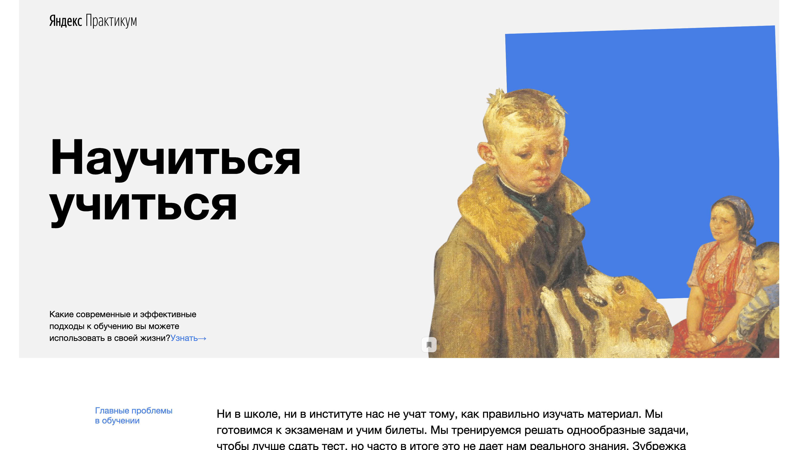

# Научиться учиться (How-to-learn)

[GitHub Pages](https://denisshamanskiy.github.io/how-to-learn/ "Научиться учиться")

## Описание проекта:

Учебный проект в Яндекс.Практикум.
Результат двух практических работ по изучению базовых возможностей HTML и CSS.

## В проекте использовались:

- Методология БЭМ
- Flexbox верстка
- iframe
- Анимация
- Кейфреймы
- CSS-директивы
